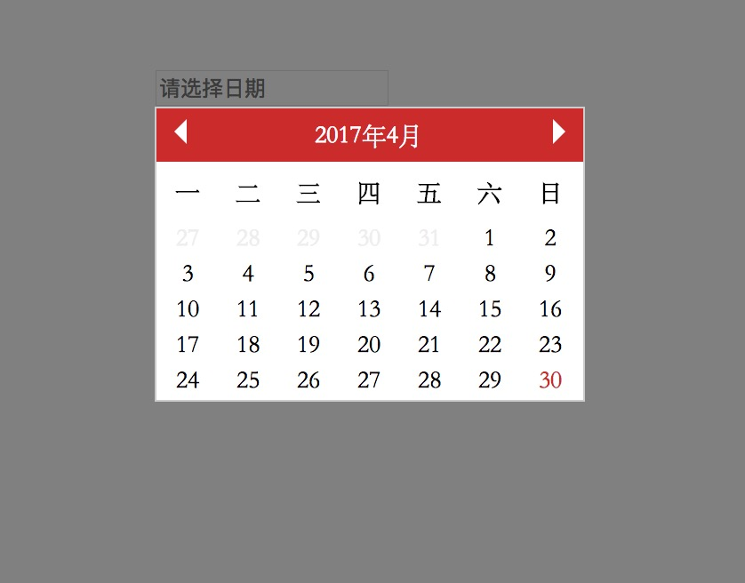

# 日历UI组件

## 使用

### HTML
	<input class="date" type="text" readonly name="" value="" data-init='' placeholder="请选择日期">

### JavaScript
	$('.date').click(function () {
        new datePicker($(this));
    });

### 效果图

